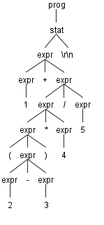

**AntlrExpr笔记**
====
[](https://github.com/mengdemao/AntlrExpr/actions/workflows/build.yml)


## 语法文件

### 编译指令

antlr4脚本内容
```shell
# antlr4编译脚本
java org.antlr.v4.Tool %*

# grun运行程序
java org.antlr.v4.gui.TestRig %*

# 编译G4文件
antlr4 Test.g4

# 编译java
javac *.java

# 运行程序
grun Test prog -gui
```
## antlr运行时

### 生成法分析树
> 写法相对固定,携程如下的固定即可

```c
// 输入字符串
ANTLRInputStream input(InputString);

// 词法解析
ExprLexer lexer(&input);

// 分割单词
CommonTokenStream tokens(&lexer);

// 解析语法单元
ExprParser parser(&tokens);

// 生成语法树
ParseTree *tree = parser.prog();
```

### 分析语法分析树

测试语句

```sh
./AntlrExpr "1 + ( 2 - 3 ) * 4 / 5"
```

<div align=center>

<div>

#### 监听器(Listener)

为了将遍历树时触发的时间转换为监听器的调用,antlr提供了ParseTree-Walker类,我们可以实现对应处理节点的接口,每条规则都有对应的`enter`和`exit`规则

| 事件        | 数据 |
| ----------- | ---- |
| enterAddSub | +    |
| enterInt    | 1    |
| exitInt     | 1    |
| enterMulDiv | /    |
| enterMulDiv | *    |
| enterAddSub | -    |
| enterInt    | 2    |
| exitInt     | 2    |
| enterInt    | 3    |
| exitInt     | 3    |
| exitAddSub  | -    |
| enterInt    | 4    |
| exitInt     | 4    |
| exitMulDiv  | *    |
| enterInt    | 5    |
| exitInt     | 5    |
| exitMulDiv  | /    |
| exitAddSub  | +    |

#### 访问器(Visitor)

| 事件        | 数据 |
| ----------- | ---- |
| visitAddSub |	+    |
| visitInt    |	1    |
| visitMulDiv |	/    |
| visitMulDiv |	*    |
| visitAddSub |	-    |
| visitInt	  | 2    |
| visitInt	  | 3    |
| visitInt	  | 4    |
| visitInt	  | 5    |
