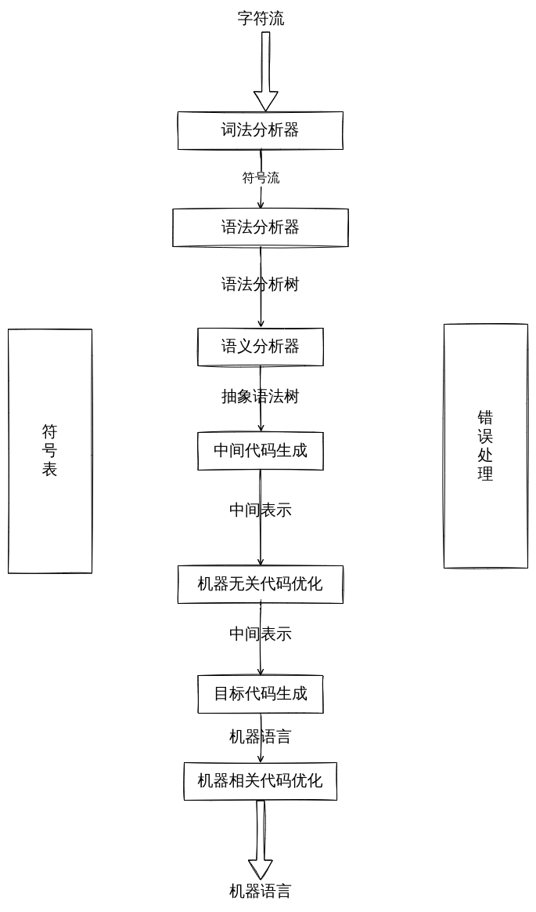
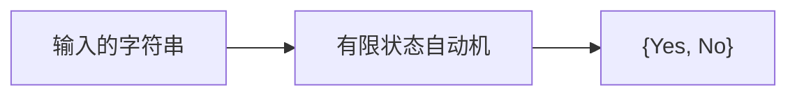
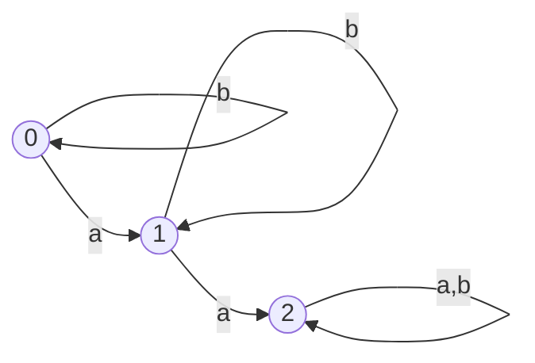
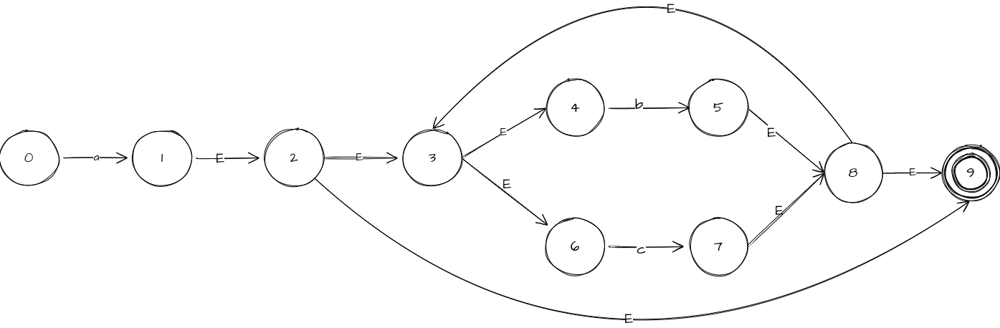
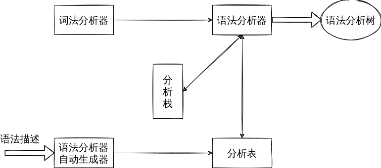

编译原理
====
> 只涉及到了编译原理前端,可以学习ANTLR的基础知识即可

[TOC]



## 词法分析

### `正则表达式`

+ 对于给定的正则表达式 $\Sigma$={c1, c2, c3...cn}
+ 归纳定义:
  + 对于空串是正则表达式$\epsilon$是正则表达式
  + 对于任何$c\in\Sigma$,$c$是正则表达式
  + 如果M和N都是正则表达式,那么下面的也是正则表达式
    + 选择: M | N = {M, N}
    + 连接: MN = {mn| m $\in$ M, n, $\in$ M }
    + 闭包: M* = {$\epsilon$, M, MM, MMMM....}

### `有限状态自动机(FA)`



#### 数学描述
M = ($\Epsilon$, $S$, $q0$, $F$, $\delta$)
+ $\Epsilon$ 字母表
+ $S$ 状态集
+ $q0$ 初始状态
+ $F$ 终止状态
+ $\delta$ 转移函数

#### 例子
+ 下面什么样子的串可以接受

+ 转移函数
  + ($q0$, a) --> $q1$, ($q0$, b) --> $q0$,
  + ($q1$, a) --> $q2$, ($q1$, b) --> $q1$,
  + ($q2$, a) --> $q2$, ($q2$, b) --> $q2$,

### 自动生成


#### Thompson算法

##### 解释
+ 基于RE的结构进行归纳
  + 对基本的RE进行直接构造
  + 对于复合的RE进行递归构造 
+ 递归,容易实现
  + 代码实现较少

#### 例子
$a(b|c)*$

#### 子集构造算法

#### Hopcroft算法

## 语法分析

### 自顶向下

#### LL(1)分析文法
> 鉴于自定向下分析法存在回溯的问题,对于现代编译器设计是不可以接受的;由此提出了LL(1)分析文法



给出文法
```
0: S -> N V M
1: N -> s
2:   | t
3:   | g
4:   | w
5: V -> e
6:   | d
```

那么同时给出LL(1)分析表

| `N\T` |  `s`  |  `t`  |  `g`  |  `w`  |  `e`  |  `d`  |
| :---: | :---: | :---: | :---: | :---: | :---: | :---: |
|  `S`  |   0   |   0   |   0   |   0   |   X   |   X   |
|  `N`  |   1   |   2   |   3   |   4   |   X   |   X   |
|  `V`  |   X   |   X   |   X   |   X   |   5   |   6   |

那么在分析`g d w`语句的时候,可以得到如下的分析

解析算法
```pascal
tokens[];
i=0;
```

那么就可以得到一个没有回溯的分析算法,但是怎么得到这个分析表呢？

##### `FIRST`集

##### `FOLLOW`集


##### `SELECT`集


### 自底向上

#### `LR(0)分析算法`

## 语义分析